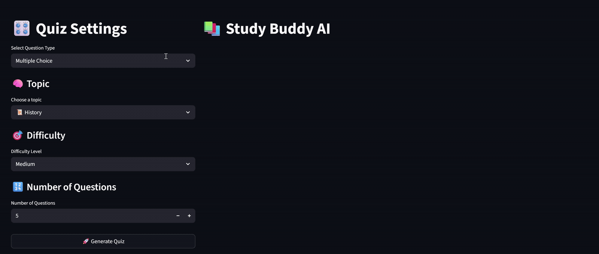

# 🎓 **LLMOps StudyBuddy — Project Overview**

This repository presents a complete **LLMOps workflow** for **StudyBuddy**, an intelligent quiz-generation system powered by LLMs.  
It integrates **LLM question generation**, **Streamlit UI**, **containerisation**, **Kubernetes deployment**, and a fully automated **CI/CD pipeline** using **Jenkins**, **ArgoCD**, and **GitHub Webhooks**.

<p align="center">
  
</p>

<p align="center">
  
</p>

## 🧩 **Grouped Stages**

|   #     | Stage                                   | Description |
| :-----: | :-------------------------------------- | :---------- |
| **00**  | **Project Setup**                       | Established the base VS Code structure, environment files, dependency management, and core configuration. |
| **01–05** | **Core LLM Logic**                    | Implemented question schemas, prompt templates, a Groq client, a high-level question generator, and quiz/helper utilities — forming the core reasoning and quiz engine. |
| **06**  | **Streamlit Application**               | Developed a full-featured Streamlit UI for quiz configuration, question display, scoring, and CSV export of results. |
| **07**  | **Containerisation & Manifests**        | Authored the Dockerfile and Kubernetes manifests required to deploy the StudyBuddy app as a containerised service. |
| **08**  | **GCP VM & Docker Setup**               | Provisioned a GCP VM, installed Docker Engine, and prepared the host environment for container builds and cluster tooling. |
| **09**  | **Minikube & kubectl Setup**            | Installed and configured Minikube and kubectl on the VM to run a local Kubernetes cluster. |
| **10**  | **GitHub Integration & Firewall Setup** | Cloned the GitHub repository onto the VM, configured Git identity and personal access tokens, and set up firewall rules for external access. |
| **11**  | **Continuous Integration (Jenkins)**    | Installed Jenkins via Docker-in-Docker, configured plugins and credentials, and created a Jenkinsfile to define the CI pipeline. |
| **12**  | **Continuous Deployment (ArgoCD)**      | Installed ArgoCD, connected it to the repo, created a GitOps application, and automated deployments to the Kubernetes cluster. |
| **13**  | **GitHub Webhooks**                     | Added GitHub webhooks to automatically trigger Jenkins on each push, closing the loop for fully automated CI/CD. |

## 🗂️ **Project Structure**

```text
LLMOPS-STUDY-BUDDY/
├── Dockerfile                         # 🐳 Builds the StudyBuddy container image for deployment
├── Jenkinsfile                        # ⚙️ Jenkins CI/CD pipeline (build → push → deploy via GitOps)
├── manifests/                         # ☸️ Kubernetes manifests used by ArgoCD
│   ├── deployment.yaml                # Kubernetes Deployment for running the StudyBuddy Streamlit app
│   └── service.yaml                   # NodePort Service exposing the StudyBuddy web interface
├── .venv/                             # Local virtual environment (created by uv or Python tooling)
├── .env                               # API keys + environment variables (GROQ API key, etc.)
├── .gitignore                         # Ignore rules for venv, logs, compiled files, artefacts
├── .python-version                    # Python version pin (ensures consistent environment)
├── app.py                             # 🎨 Streamlit front-end application entrypoint for StudyBuddy
├── img/                               # 📸 All project documentation screenshots and GIFs
├── llmops_study_buddy.egg-info/       # 📦 Auto-generated metadata folder created by setup.py
├── pyproject.toml                     # 🧩 Project metadata, build config, dependency definitions
├── requirements.txt                   # 📦 Runtime requirements (Streamlit, LangChain, Groq, etc.)
├── setup.py                           # 🔧 Editable install config for pip/packaging
├── uv.lock                            # 🔒 Exact dependency lockfile generated by uv
└── src/                               # 🧠 Core StudyBuddy source code (LLM logic + utils)
    ├── common/                        # 🪵 Shared utilities
    │   ├── __init__.py                # Marks directory as a Python package
    │   ├── custom_exception.py        # Centralised error-handling class with rich traceback context
    │   └── logger.py                  # Logging configuration (file + console)
    ├── config/                        # ⚙️ Environment + global settings
    │   ├── __init__.py                # Marks directory as a Python package
    │   └── settings.py                # Settings loader (API keys, model params, retries)
    ├── models/                        # 🧱 Pydantic schemas for question structures
    │   ├── __init__.py                # Marks directory as a Python package
    │   └── question_schemas.py        # MCQ + fill-blank typed schemas ensuring structured output
    ├── prompts/                       # 🗣️ Prompt templates for LLM question generation
    │   ├── __init__.py                # Marks directory as a Python package
    │   └── templates.py               # PromptTemplates for MCQ + fill-blank JSON responses
    ├── llm/                           # 🤖 Groq LLM client integration
    │   ├── __init__.py                # Marks directory as a Python package
    │   └── groq_client.py             # Factory returning configured Groq Chat model
    ├── generator/                     # 🧠 High-level question generation logic
    │   ├── __init__.py                # Marks directory as a Python package
    │   └── question_generator.py      # Orchestrates prompts → LLM → Pydantic parsing + fallback retry
    └── utils/                         # 🧪 Helper functions for Streamlit UI + quiz management
        ├── __init__.py                # Marks directory as a Python package
        └── helpers.py                 # QuizManager, scoring logic, CSV export, rerun helpers
````

## 🚀 **Summary**

The **LLMOps StudyBuddy** project demonstrates how to take a full LLM-powered educational application from **core logic** to **production-grade deployment**.

It combines:

* Typed schemas, structured prompts, and a Groq-backed LLM client
* A Streamlit UI for interactive quiz generation and evaluation
* Docker-based containerisation and Kubernetes manifests
* CI with Jenkins and image publication to DockerHub
* CD with ArgoCD and a clean GitOps workflow
* Webhooks for fully automatic, push-triggered deployments

Taken together, this forms a **fully automated LLMOps pipeline** for StudyBuddy — from a single quiz request in the UI all the way down to cloud-native infrastructure and GitOps automation.
