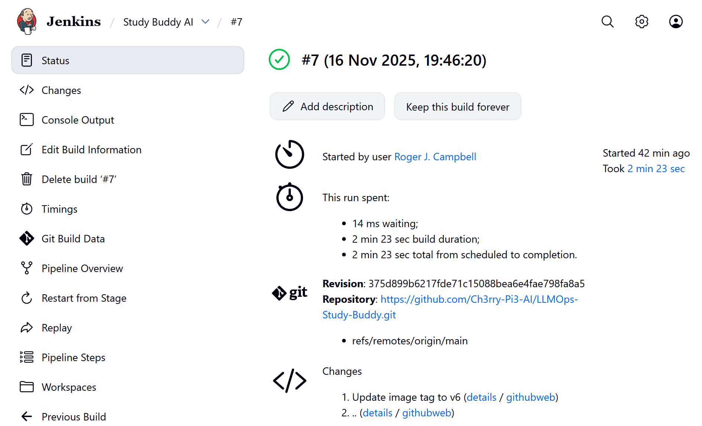
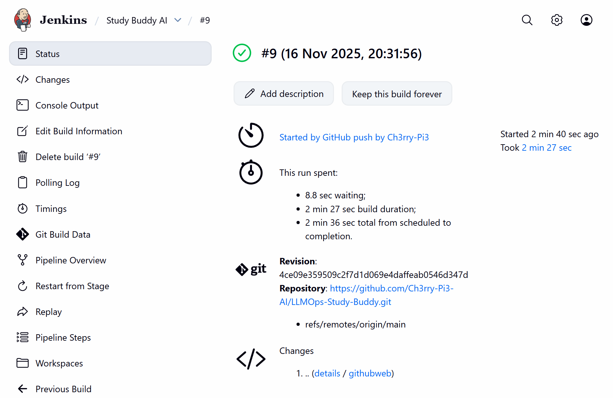

# 🔔 **1️⃣ Webhooks — Automating CI/CD Trigger with GitHub and Jenkins**

This stage enables **full CI/CD automation** for the **LLMOps StudyBuddy** project.
Until now, you manually triggered the Jenkins pipeline after each Git push.
With **GitHub Webhooks**, Jenkins will now automatically start the pipeline whenever you push new commits.

## 🧩 **2️⃣ What Webhooks Do**

A **Webhook** is an automatic notification system between GitHub and Jenkins.

Whenever you push to GitHub:

1. GitHub immediately sends a JSON payload to Jenkins
2. Jenkins receives the hook
3. Jenkins triggers your CI/CD pipeline automatically
4. The pipeline builds the Docker image
5. Pushes it to DockerHub
6. ArgoCD detects the update and deploys it to Kubernetes

No more manual “Build Now”.

## ⚙️ **3️⃣ Configure a Webhook in GitHub**

1. Open your **StudyBuddy GitHub repository**
2. Click **Settings**
3. Select **Webhooks**
4. Click **Add webhook**

In **Payload URL**, enter your Jenkins external IP and the GitHub webhook endpoint:

```
http://<YOUR_VM_EXTERNAL_IP>:8080/github-webhook/
```

**Content type:** `application/json`

<p align="center">
  
</p>

Click **Add Webhook**.

## 🧠 **4️⃣ Configure Jenkins to Accept Webhooks**

1. Open **Jenkins Dashboard**
2. Click your pipeline (**GITOPS PROJECT** or your chosen name**)
3. Click **Configure**
4. Scroll to **Build Triggers**
5. Enable:

```
GitHub hook trigger for GITScm polling
```

<p align="center">
  
</p>

Click **Apply**, then **Save**.

Jenkins will now listen for GitHub push events.

## 🔄 **5️⃣ Test the Webhook**

Create a harmless commit to your repo:

```bash
git add .
git commit -m "Testing Webhook Trigger"
git push origin main
```

Go to your Jenkins Dashboard.
Within a few seconds, Jenkins should automatically start a new build.

## 👀 **6️⃣ Verify the Trigger Source**

Previously, manual builds displayed something like:

<p align="center">
  
</p>

After setting up the webhook, open the new auto-triggered build and check the top lines.
It should show:

<p align="center">
  
</p>

This confirms GitHub successfully triggered the pipeline.

## 🎯 **7️⃣ What You Have Achieved**

You now have a **fully automated StudyBuddy CI/CD pipeline**:

1. Push to GitHub
2. GitHub Webhook notifies Jenkins
3. Jenkins builds the Docker image
4. Jenkins pushes to DockerHub
5. ArgoCD detects changes in repo
6. ArgoCD deploys to Kubernetes
7. Minikube exposes the service
8. The live StudyBuddy app updates automatically

This is full GitOps automation.

## 🧹 **8️⃣ Optional Cleanup**

To shut down resources:

* Go to **Google Cloud Console → Compute Engine → VM Instances**
* Stop or delete the VM

This prevents unnecessary billing.

## ✅ **9️⃣ Project Complete**

You have now implemented:

* Continuous Integration
* Continuous Deployment
* Docker → Kubernetes automation
* GitOps via ArgoCD
* Automatic CI/CD triggers via Webhooks

Your **LLMOps StudyBuddy** system is now a fully automated, production-grade pipeline.
