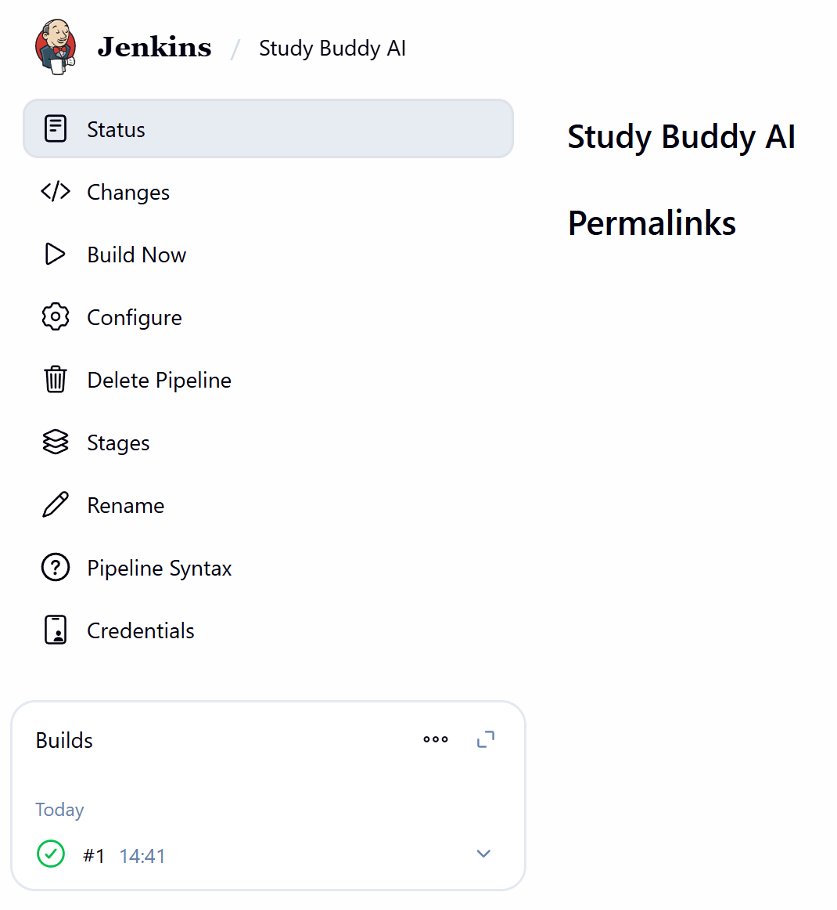
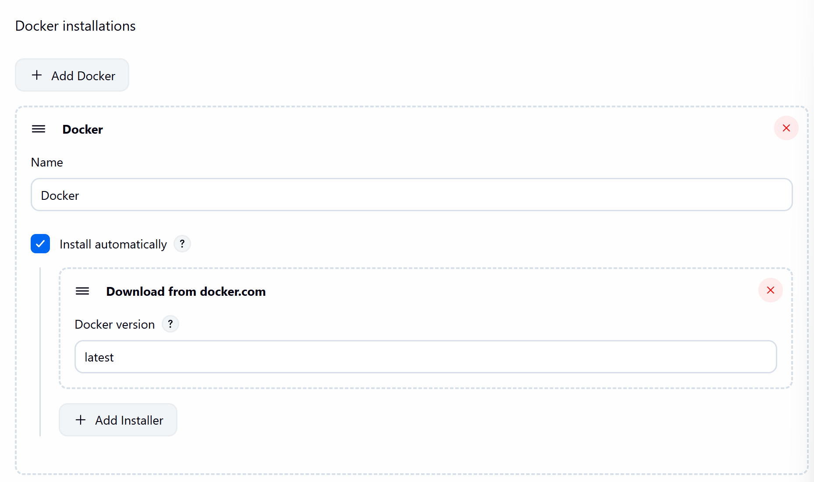

# ⚙️ **Jenkins Setup on GCP VM using Docker-in-Docker (DinD) — LLMOps StudyBuddy**

In this stage, you will set up **Jenkins** on your **Google Cloud Platform (GCP) Virtual Machine** using a **Docker-in-Docker (DinD)** configuration.
This allows Jenkins to run inside a Docker container while still having access to the host machine’s Docker daemon, enabling full CI/CD capabilities for the **LLMOps StudyBuddy** project.

## 🧩 1️⃣ Ensure Jenkins Runs on the Same Network as Minikube

Run:

```bash
docker run -d --name jenkins \
  -p 8080:8080 \
  -p 50000:50000 \
  -v /var/run/docker.sock:/var/run/docker.sock \
  -v $(which docker):/usr/bin/docker \
  -u root \
  -e DOCKER_GID=$(getent group docker | cut -d: -f3) \
  --network minikube \
  jenkins/jenkins:lts
```

Check:

```bash
docker ps
```

## 🧠 2️⃣ Retrieve the Jenkins Admin Password

```bash
docker logs jenkins
```

Copy the autogenerated admin password.

## 🌐 3️⃣ Access Jenkins in the Browser

Navigate to:

```
http://<YOUR_VM_EXTERNAL_IP>:8080
```

<p align="center">
  
</p>

## 🧩 4️⃣ Install Plugins and Create Admin User

Install suggested plugins:

<p align="center">
  
</p>

Create admin user:

<p align="center">
  
</p>

Jenkins dashboard:

<p align="center">
  
</p>

## 🔧 5️⃣ Install Required Jenkins Plugins

From **Manage Jenkins → Plugins**, install:

* Docker
* Docker Pipeline

<p align="center">
  
</p>

Then install:

* Kubernetes

<p align="center">
  
</p>

## 🔁 6️⃣ Restart Jenkins

```bash
docker restart jenkins
```

## 🧱 7️⃣ Set Up Python Inside Jenkins Container

```bash
docker exec -it jenkins bash
apt update -y
apt install -y python3 python3-pip python3-venv
ln -s /usr/bin/python3 /usr/bin/python
exit
docker restart jenkins
```

## 🔐 8️⃣ Add GitHub Credentials in Jenkins

Go to **Manage Jenkins → Credentials → (global)**.

<p align="center">
  
</p>

Add credentials:

* Username: GitHub username
* Password: **GitHub Personal Access Token**
* ID: `github-token`

<p align="center">
  
</p>

## 🚀 9️⃣ Create a New Jenkins Pipeline

Create a pipeline named:

```
GITOPS PROJECT
```

<p align="center">
  
</p>

## 🧠 1️⃣0️⃣ Configure Pipeline to Use GitHub

Pipeline script from SCM → Git → paste repo URL → select `github-token` → set branch:

```
*/main
```

<p align="center">
  
</p>

## 🧩 1️⃣1️⃣ Generate Jenkins Pipeline Script

Go to **Pipeline Syntax** and generate:

```
checkout: Check out from version control
```

Copy the generated Groovy block for later use in the Jenkinsfile.

## 🧾 1️⃣2️⃣ Create Jenkinsfile and Test Pipeline

Inside your project directory:

### Create a **Jenkinsfile**:

Include the full file (you can paste your own or ask me to generate one).
For now, **comment out all stages except the first one** (testing purposes).

Replace:

```
checkout scmGit(branches: …
```

with the **Pipeline Syntax checkout script** generated in the previous step.

Save the file and push to GitHub:

```bash
git add Jenkinsfile
git commit -m "Added Jenkinsfile"
git push
```

On your VM:

```bash
git pull
```

Run your pipeline:

* Jenkins Dashboard → your pipeline → **Build Now**

You should see a green tick:

<p align="center">
  
</p>

## 🐳 1️⃣3️⃣ Configure Docker in Jenkins

Go to:

**Manage Jenkins → Tools**

Scroll to bottom → click **+ Add Docker**.

* Name: `Docker`
* Install automatically
* Add installer → **Download from docker.com**

<p align="center">
  
</p>

Apply and Save.

## 🐙 1️⃣4️⃣ Create DockerHub Repository and Token

Log in to DockerHub:

1. Create a repository:
   Name it:

```
studybuddy
```

2. Go to **Account Settings → Personal Access Tokens**
3. Create a token named:

```
llmops-token
```

Permissions: **Read, Write, Delete**

## 🔐 1️⃣5️⃣ Add DockerHub Credentials to Jenkins

Go to:

**Manage Jenkins → Credentials → global → Add Credentials**

* Username: DockerHub username
* Password: personal access token
* ID: `dockerhub-token`
* Description: `dockerhub-token`

Save.

## 📝 1️⃣6️⃣ Update Jenkinsfile for Docker Builds

Uncomment the environment block:

```groovy
environment {
    DOCKER_HUB_REPO = "ch3rrypi3/studybuddy"
    DOCKER_HUB_CREDENTIALS_ID = "dockerhub-token"
    IMAGE_TAG = "v${BUILD_NUMBER}"
}
```

Update with your actual repo details.

Then uncomment:

```groovy
stage('Build Docker Image') {
    steps {
        script {
            echo 'Building Docker image...'
            dockerImage = docker.build("${DOCKER_HUB_REPO}:${IMAGE_TAG}")
        }
    }
}

stage('Push Image to DockerHub') {
    steps {
        script {
            echo 'Pushing Docker image to DockerHub...'
            docker.withRegistry('https://registry.hub.docker.com', "${DOCKER_HUB_CREDENTIALS_ID}") {
                dockerImage.push("${IMAGE_TAG}")
            }
        }
    }
}
```

Commit and push your updated Jenkinsfile:

```bash
git add .
git commit -m "Enabled Docker build and push stages"
git push
```

On your VM:

```bash
git pull
```

## ☸️ 1️⃣7️⃣ Update Kubernetes Deployment

Open:

```
manifests/deployment.yaml
```

Replace line:

```
image: ch3rrypi3/studybuddy:latest
```

with your own repo and tag format (or keep `latest`).

Push your changes:

```bash
git add .
git commit -m "Updated deployment image"
git push
```

Pull on VM:

```bash
git pull
```

## 🚀 1️⃣8️⃣ Re-run Jenkins Pipeline

Go back to Jenkins and click:

**Build Now**

If successful, your new Docker image will appear in DockerHub → your repository → tags.