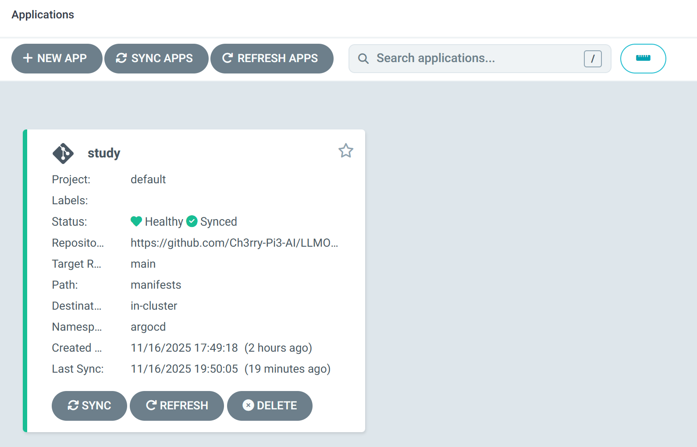
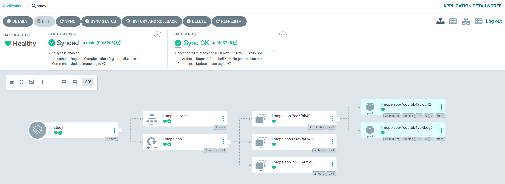

# 🚀 **Continuous Deployment (CD) with ArgoCD — LLMOps StudyBuddy**

With the previous CI stages complete, this stage adds **Continuous Deployment (CD)** using **ArgoCD**.
ArgoCD follows a **GitOps** approach: it continuously watches your Git repository and automatically syncs manifests into your Kubernetes cluster, keeping the **LLMOps StudyBuddy** deployment in sync with Git.

## 🧩 1️⃣ Verify Existing Kubernetes Namespaces

Before installing ArgoCD, list your namespaces:

```bash
kubectl get namespace
```

Example output:

```bash
NAME              STATUS   AGE
default           Active   6h13m
kube-node-lease   Active   6h13m
kube-public       Active   6h13m
kube-system       Active   6h13m
```

## 🧠 2️⃣ Create a Namespace for ArgoCD

Create a dedicated namespace for ArgoCD:

```bash
kubectl create ns argocd
```

Example output:

```bash
namespace/argocd created
```

## ⚙️ 3️⃣ Install ArgoCD

Install ArgoCD into the `argocd` namespace:

```bash
kubectl apply -n argocd -f https://raw.githubusercontent.com/argoproj/argo-cd/stable/manifests/install.yaml
```

Check ArgoCD resources:

```bash
kubectl get all -n argocd
```

Example:

```bash
NAME                                                    READY   STATUS    RESTARTS   AGE
pod/argocd-application-controller-0                     1/1     Running   0          84s
pod/argocd-applicationset-controller-7b6ff755dc-b489w   1/1     Running   0          84s
pod/argocd-dex-server-584f7d88dc-mzgdd                  1/1     Running   0          84s
pod/argocd-notifications-controller-67cdd486c6-fcw7w    1/1     Running   0          84s
pod/argocd-redis-6dbb9f6cf4-rqk4c                       1/1     Running   0          84s
pod/argocd-repo-server-57bdcb5898-4pvjc                 1/1     Running   0          84s
pod/argocd-server-57d9cc9bcf-brndd                      1/1     Running   0          84s
```

All pods should be **READY 1/1** and **STATUS Running**.

## 🌐 4️⃣ Change ArgoCD Service Type to NodePort

By default, `argocd-server` is a **ClusterIP**, only accessible inside the cluster.
Change it to **NodePort**:

```bash
kubectl edit svc argocd-server -n argocd
```

Find:

```yaml
type: ClusterIP
```

Change to:

```yaml
type: NodePort
```

Save and exit (`Esc`, then `:wq!` and Enter).

Verify:

```bash
kubectl get svc -n argocd
```

Example:

```bash
NAME                             TYPE        CLUSTER-IP       EXTERNAL-IP   PORT(S)                      AGE
argocd-applicationset-controller ClusterIP   10.110.183.134   <none>        7000/TCP,8080/TCP            12m
argocd-dex-server                ClusterIP   10.96.53.58      <none>        5556/TCP,5557/TCP,5558/TCP   12m
argocd-server                    NodePort    10.103.90.51     <none>        80:30756/TCP,443:32227/TCP   12m
```

Confirm that **argocd-server** is now `NodePort`.

## 🔁 5️⃣ Forward Port for External Access

Expose ArgoCD externally via the NodePort:

```bash
kubectl port-forward --address 0.0.0.0 service/argocd-server 32227:80 -n argocd
```

Replace `32227` with the actual NodePort mapped to port 80 on `argocd-server`.

You should see:

```bash
Forwarding from 0.0.0.0:32227 -> 8080
Handling connection for 32227
```

Leave this terminal running.

## 🌍 6️⃣ Access ArgoCD in the Browser

Use your VM **External IP** plus the NodePort:

```text
http://<YOUR_EXTERNAL_IP>:32227/
```

First connection will show a warning:

<p align="center">
  
</p>

Click **Advanced**, then **Proceed to <your external IP> (unsafe)**:

<p align="center">
  
</p>

You should now see the **ArgoCD login screen**:

<p align="center">
  
</p>

## 🔑 7️⃣ Retrieve the ArgoCD Admin Password

In a new SSH session:

```bash
kubectl get secret -n argocd argocd-initial-admin-secret -o jsonpath="{.data.password}" | base64 -d
```

Copy the output; this is the **admin password**.

Log into ArgoCD:

* **Username:** `admin`
* **Password:** your copied password

You should now see the ArgoCD **Dashboard**:

<p align="center">
  
</p>

## 🧠 8️⃣ Prepare kubeconfig for Jenkins (Kubernetes Access)

On the VM:

```bash
cd ~
ls -la
```

You should see a `.kube` directory. Inspect:

```bash
ls -la .kube/
cat .kube/config
```

Copy the contents of the config file into a local text editor (e.g. Notepad).

In that local copy, replace:

* `certificate-authority` with `certificate-authority-data`
* `client-certificate` with `client-certificate-data`
* `client-key` with `client-key-data`

Then, on the VM, base64-encode the referenced files:

```bash
cat /home/<your-username>/.minikube/ca.crt | base64 -w 0; echo
cat /home/<your-username>/.minikube/profiles/minikube/client.crt | base64 -w 0; echo
cat /home/<your-username>/.minikube/profiles/minikube/client.key | base64 -w 0; echo
```

Paste each base64 output into the corresponding `*-data` fields in your local kubeconfig copy.

## 💾 9️⃣ Create Local kubeconfig File for Jenkins

On your local machine (e.g. via Git Bash):

```bash
cd Downloads
vi kubeconfig
```

Press `i`, paste the full edited kubeconfig content, then:

* `Esc`
* `:wq!`
* Enter

You now have a raw `kubeconfig` file (no `.txt` extension).

## 🔐 🔟 Upload kubeconfig to Jenkins

In Jenkins:

1. **Manage Jenkins → Credentials → (global)**
2. Click **Add Credentials**
3. Set **Kind** → `Secret file`
4. Upload your `kubeconfig` file
5. Set **ID**:

```text
kubeconfig
```

<p align="center">
  
</p>

Click **Create**.

## ⚙️ 1️⃣1️⃣ Generate Jenkins Pipeline Step for Kubernetes

From your Jenkins pipeline page, click **Pipeline Syntax**.

In **Sample Step**, choose:

```text
kubeconfig: Setup Kubernetes CLI (kubectl)
```

Then on the VM, get your Kubernetes endpoint:

```bash
kubectl cluster-info
```

Example:

```bash
Kubernetes control plane is running at https://192.168.49.2:8443
CoreDNS is running at https://192.168.49.2:8443/api/v1/namespaces/kube-system/services/kube-dns:dns/proxy
```

Copy the first URL and paste it into **Kubernetes server endpoint** in Jenkins.
Select your `kubeconfig` credential and click **Generate Pipeline Script**.

Copy the generated snippet for use in your Jenkinsfile.

## 🧾 1️⃣2️⃣ Configure ArgoCD Repository Connection

Inside the ArgoCD UI:

1. Go to **Settings → Repositories → + Connect Repo**

2. Select **VIA HTTP/HTTPS** (not SSH)

3. Fill in:

   * **Name:** `github`
   * **Project:** `default`
   * **Repository URL:** your StudyBuddy GitHub repo URL
   * **Username:** your GitHub username
   * **Password:** your GitHub Personal Access Token

4. Click **Connect**

ArgoCD should now show the repo as **Healthy / Successfully connected**.

## 🧱 1️⃣3️⃣ Create an ArgoCD Application for StudyBuddy

From the ArgoCD dashboard:

1. Go to **Applications → + NEW APP**

Configure:

**General**

* **Application Name:** `studybuddy-gitops`
* **Project Name:** `default`
* Tick ✅ **AUTO-CREATE NAMESPACE** (if using a non-default destination)
* Enable ✅ **PRUNE RESOURCES** and ✅ **SELF HEAL**

**Source**

* **Repository URL:** your StudyBuddy repo
* **Revision:** `main`
* **Path:** `manifests`

<p align="center">
  
</p>

<p align="center">
  
</p>

Click **Create**.

You should now see the app:

<p align="center">
  
</p>

Click into it for deployment details:

<p align="center">
  
</p>

## 🔄 1️⃣4️⃣ Run Jenkins Pipeline and Let ArgoCD Deploy

Ensure all latest changes (including manifests and image tags) are pushed to GitHub.

Then:

* Run your Jenkins pipeline (CI + Docker build + push)
* ArgoCD will detect Git changes and sync them into the cluster

The **LLMOps StudyBuddy** application will be deployed/updated automatically.

## 🌐 1️⃣5️⃣ Expose the StudyBuddy Streamlit App Externally

First, start the Minikube tunnel:

```bash
minikube tunnel
```

Example output:

```bash
Status:
        machine: minikube
        pid: 412124
        route: 10.96.0.0/12 -> 192.168.49.2
        minikube: Running
        services: [llmops-service]
    errors:
                minikube: no errors
                router: no errors
                loadbalancer emulator: no errors
```

In another terminal, forward the StudyBuddy service:

```bash
kubectl port-forward svc/llmops-service --address 0.0.0.0 9090:80
```

(If you deployed into a different namespace, add `-n <namespace>`.)

Now open:

```text
http://<YOUR_EXTERNAL_IP>:9090/
```

You should see your **LLMOps StudyBuddy Streamlit app** running and accessible.

<p align="center">
  
</p>

## ✅ Summary

At this point you have a full **GitOps-based CD pipeline** for **LLMOps StudyBuddy**:

* ArgoCD installed and exposed via NodePort
* Jenkins authenticated to Kubernetes via kubeconfig
* ArgoCD watching your GitHub repo for `manifests/` changes
* A StudyBuddy application deployed and continuously updated to your Minikube cluster via Git + Jenkins + ArgoCD

